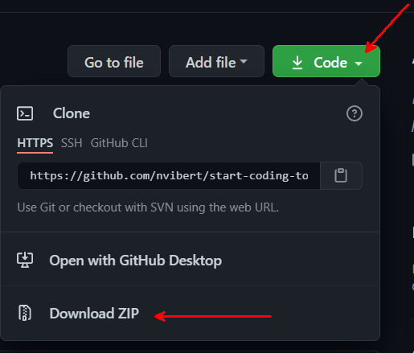

# Start Coding Today 

## Introduction to API calls
Co-presented by Patrick Kremer and Nico Vibert.
This session will be presented at the internal VMware conference TechSummit.

## Objectives

In 45 minutes, attendees will be able to learn and practice coding with a VMware environment, giving them a little taste of the power of automation.

## Requirements

A browser with Internet access.

That's it. No coding experience required.

## What the attendee will do during the session:

* Learn the basic concepts behind REST APIs
* Run a PowerCLI script against a vCenter
* Run API calls with Curl against a vCenter
* Deploy VMware resources with Terraform
* Invoke REST APIs with Python

## Session Structure

### Part 1 - Introduction

Welcome to the session. This session is for anyone who's never had the confidence or the motivation to learn to code. 
It's hard to get started with coding without a use case, a mentor, an environment you can learn and a safe place where there's no stupid questions.

This is a short session and this session is more of an introduction to coding for folks who have a background as infrastructure and virtualization administrators and would like to understand the 'art of the possible'. 

### Part 2a - Live - Desktop Access

For VMware attendees, access your VDI session. Usernames and passwords will be provided in the Zoom session.

### Part 2b - Offline with your own vCenter

Obviously you are welcome to run the commands above in your own lab!

You will need to install:
- [Python3](https://wiki.python.org/moin/BeginnersGuide/Download)
- [Terraform](https://learn.hashicorp.com/tutorials/terraform/install-cli)
- [PowerShell](https://docs.microsoft.com/en-us/powershell/scripting/install/installing-powershell?view=powershell-7.1)
- [PowerCLI](https://code.vmware.com/docs/13638/powercli-12-3-0-user-s-guide/GUID-ACD2320C-D00F-4CCE-B968-B3C41A95C085.html)

You also need a code editor. [VS Code](https://code.visualstudio.com/download) is free and cross-platform. 

If you want to start learning Git, which we strongly recommend if you're going to learn about code, you can [install it](https://git-scm.com/book/en/v2/Getting-Started-Installing-Git). You can then clone this code repo with `git clone https://github.com/nvibert/start-coding-today.git`

Alternatively, you can download the code in zip format from the [repo](https://github.com/nvibert/start-coding-today) 

### Part 3 - PowerCLI

PowerCLI is one of the most common tools to automate tasks against a VMware environment. PowerCLI abstracts the API calls by providing a command-line interface tool that is self-explanatory.

PowerCLI is a collection of Windows Powershell modules which are used to manage and maintain a VMware virtual environment. 
PowerCLI is a great tool for system administrators and can be used to gather detailed information and/or execute bulk commands against multiple VMs, Hosts, Network or Storage devices.

Open the PowerShell windows and run the following command:

```powershell
Connect-VIServer -Server vcenter.sddc-A-B-C-D.vmwarevmc.com -Protocol https -User cloudadmin@vmc.local -Password 'qwerty'
```
    
You are now connected to a VMware Cloud vCenter.

Now that you are connected, you can run multiple PowerCLI commands, such as the following. Note how you can use Tab to auto-complete the commands.

```powershell
Get-VM

Get-VMHost

Get-Folder

Get-Datacenter

Get-Datastore
```

You can run the following command to understand why cmdlets are supported:
```powershell
Get-Command -Module *VMware*
```

Let's try to create a new folder inside an existing folder. One way to do this is to create a PowerShell variable, using the '$' prefix.

```powershell
$WorkloadsFolder = Get-Folder -Name Workloads
```

Now you can refer to this variable in your next command and create a sub-folder. Update the folder name with your own username.

```powershell
New-Folder "your_user_name_power_cli_folder" -Location $WorkloadsFolder
```

By now, you should know how to check if your folder has been successfully created. Can you find out the UID of the new folder?

Great! You've just used some scripts to create vSphere resources over APIs. Yes, PowerCLI just executes some API calls under the hood but a lot of the complexity was hidden from you.

There are many PowerCLI sample scripts you can find on VMware {code} such as:

[PowerCLI code_samples](https://code.vmware.com/samples?categories=Sample&keywords=&tags=PowerShell&groups=&filters=&sort=dateDesc&page=)

Go and explore some of the commands.

As you will see as you go through the examples, you will see that PowerCLI is not just for vSphere: there are modules for NSX-T, Horizon, vRealize, etc...
If you see a product without a PowerCLI module...well, what is stopping you from creating the module?

### Part 4 - Terraform

PowerCLI is the most commonly used VMware scripting tool and is pretty easy to pick up. It's commonly used for bulk tasks.

An alternative to PowerCLI would be Terraform - the use case is different but it can achieve similar results.

While PowerCLI's approach is to run a series of scripts to execute a task, Terraform's approach is to describe an entire infrastructure as code.

PowerCLI is great for tasks and works great for brownfield and greenfield environments. It's particularly useful for Windows workloads and for users with a Windows background!

Terraform is a great tool to build an entire templated infrastructure from scratch but works better in a greenfield environment.

Terraform builds infrastructure based on code. For example, the following code would create a vSphere Tag Category.

```hcl
resource "vsphere_tag_category" "region" {
    name        = "region"
    cardinality = "SINGLE"

    associable_types = [
    "VirtualMachine"
    ]
}
```

To create a tag using the category above, you would use the following command:

```hcl
resource "vsphere_tag" "region" {
    name         = "UK"
    category_id = vsphere_tag_category.region.id
}
```

You can see how, by using `vsphere_tag_category.region.id`, we are referring to another resource created by Terraform.

One of the advantages about using Terraform is that it is able, in most cases, to work out dependencies between each resources. For example, in this instance, Terraform would create the Tag Category before creating the Tag.

If you want to deploy a resource in something that was not created by Terraform, you can use the data block.

Imagine you want to create a Folder in the Datacenter "SDDC-Datacenter". You would do the following.

```hcl
resource "vsphere_folder" "folder" {
path          = "terraform-test-folder"
type          = "vm"
datacenter_id = data.vsphere_datacenter.dc.id
}

data "vsphere_datacenter" "dc" {
name = "SDDC-Datacenter" 
}
```

"Data" is simple a read-only API call to work out the ID of the DC in which we will deploy the folder.

Let's go and practice some of this. Go to Visual Studio Code and open the Terminal.

Clone this GitHub repo, using the command:

`git clone https://github.com/nvibert/start-coding-today.git`

If it's your first time using Git, well done!

You will see we have now download a file called main.tf . This is the main Terraform configuration.

```hcl
provider "vsphere" {
  user                 = "cloudadmin@vmc.local"
  password             = ""
  vsphere_server       = "vcenter.sddc-A-B-C-D.vmwarevmc.com"
  allow_unverified_ssl = true
}

data "vsphere_datacenter" "dc" {
  name = "SDDC-Datacenter"
}


resource "vsphere_folder" "folder" {
  path          = "your_user_name_terraform_folder"
  type          = "vm"
  datacenter_id = data.vsphere_datacenter.dc.id
}
```

Update the file with the password, the vCenter IP address and the user_name. The configuration above will create a folder.

Run the following commands:

`terraform init` to initialize the provider. Did you see "provider vsphere" in the configuration earlier? This tells Terraform to download a Terraform 'plugin' to let interact with vSphere. There are also providers for NSX-T, VMC, vRA, vCD, etc...
`terraform validate` to validate the syntax of your Terraform config file  
`terraform plan` to work out which resources Terraform will create, modify or delete on your behalf  
`terraform apply` to execute the plan.  


This is a very simple example. But imagine you add not just folders, but resources pools, clusters, tags, networks and security rules (using Terraform for NSX-T); you could define your entire VMware infrastructure as code. 

If you're enjoying Terraform and want to do something a bit more sophisticated, you could try to create vSphere tags and categories. Add this to your main.tf, run `terraform apply` and you will see that Terraform doesn't try to add another folder. Instead, it will just create the tag category and the tag.

```hcl
resource "vsphere_tag_category" "user" {
    name        = "your_user_name"
    cardinality = "SINGLE"

    associable_types = [
        "VirtualMachine"
    ]
}
resource "vsphere_tag" "last_name" {
    name         = "your_last_name"
    category_id = vsphere_tag_category.user.id
}
```

As you expand your code and your configuration, you can see how you could describe your entire infrastructure as code - not just compute but also security, networking, automation, cloud, migration, SD-WAN when you include providers for AWS, NSX, SD-WAN, HCX, vRA, etc.... 
You could then version it, repeat it, patch it, etc...

If you want to see a very advanced example, go through what Gilles and I did for VMworld:
https://github.com/gchek/VMworld2020

Finally: if you think that there is a provider missing for the product of your choice, let us know. 
Creating a provider is for advanced users as it required knowledge of the Go programming language but you know what? There are many Go programmers within VMware that can help you.

### Part 5 - REST APIs

PowerCLI and Terraform are very easy to use as you can see. But what PowerCLI and Terraform only do is making API calls under the hood.

You will find easier to understand automation by building some understanding of API architectures.

An API is an Application Programming Interface. Typically, a developer would create an API on an application or platform to enable a client to interact with it.

Most of the API requests follow the REST model on how communications with an API are executed (REST stands for Representation State Transfer).

Most common REST implementations use HTTP as the application protocol. 

Typically, API calls run a CRUD Action: Create, Read, Update or Delete.

For example:
- Create a VM
- Check the items of a content library
- Update the vSAN storage policy on a VM
- Remove a NSX network

Typically REST API requests are made through a HTTP verb, which would be:

- PUT   ===== CREATE
- GET   ===== READ
- PATCH  ==== UPDATE
- DELETE ==== DELETE

When you browse any page on the web, you just make a HTTP GET request to get the contents of a webpage.

It's the same if you want to get the contents of a vCenter, it will just be a GET call.

When you submit a form online, you just make a HTTP POST request to submit your details.

It's same when you want to create a network with NSX over the APIs: you just make a HTTP POST call, with the details about your network (subnet, mask, DHCP settings) in the body of the packet.

To leverage vSphere APIs, let's use cURL. Curl is a tool to make HTTP requests and will let us interact with the APIs directly.

Go back to your virtual desktop and open up the terminal.

The way it works with the vSphere APIs is that you need to get a temporary token in exchange for your vCenter credentials with a 

`POST https://{api_host}/rest/com/vmware/cis/session`

For example, on a Mac:

`curl -k -i -u $TF_VAR_vsphere_user:$TF_VAR_vsphere_password -X POST -c token.txt https://$TF_VAR_vsphere_server/rest/com/vmware/cis/session`

On a Windows machine, it would be:

`curl -k -i -u %TF_VAR_vsphere_user%:%TF_VAR_vsphere_password% -X POST -c token.txt https://%TF_VAR_vsphere_server%/rest/com/vmware/cis/session`

The output of the command would be something like this:

    {"value":"f3be0a4e-7fc8-48d8-b796-eb3c2f66970b"}

This temporary token above `f3be0a4e-7fc8-48d8-b796-eb3c2f66970b` can be used in subsequent API requests to authenticate against vCenter.

You can then use the value of the token to make an API call, for example, to get the list of folders in your environment (that will include the folders you created earlier):

On a Mac:

`curl -k -i -b token.txt https://$TF_VAR_vsphere_server/rest/vcenter/folder`

On a Windows machine:

`curl -k -i -b token.txt https://%TF_VAR_vsphere_server%/rest/vcenter/folder`

### Part 6 - REST APIs in Python

cURL is great for testing REST APIs, but to truly use the API you will need to use a programming language.

Open [vcenter-REST.py](python/vcenter-REST.py)

This program makes the same API calls that we did with cURL. 

Fill in the environment variables with your vCenter username, password, and URL
```
# Environment variables
VC_USERNAME = 'cloudadmin@vmc.local'
VC_PASSWORD = ''
VC_URL = ''
```
Execute the program:

`python vcenter-REST.py`

Inspect the code and the output. 

Now, try to write a GET call to list the hosts in your vCenter
If you need help, the code to do it is in vcenter-REST-host.py(python/vcenter-REST-host.py)

### Additional Resources

PowerCLI resources can be found [here](https://developer.vmware.com/powercli).

Official Terraform providers can be found [here](https://registry.terraform.io/namespaces/vmware).

Additional Terraform scripts and examples can be found on Nico's blog [here](https://nicovibert.com).

The Curl script used above was found [here](https://www.stevetrefethen.com/accessing-vmware-vcenter-rest-api-authentication-from-curl/).

